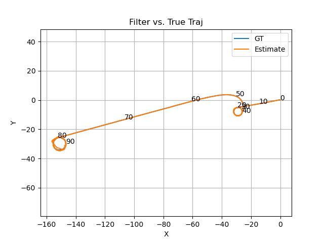
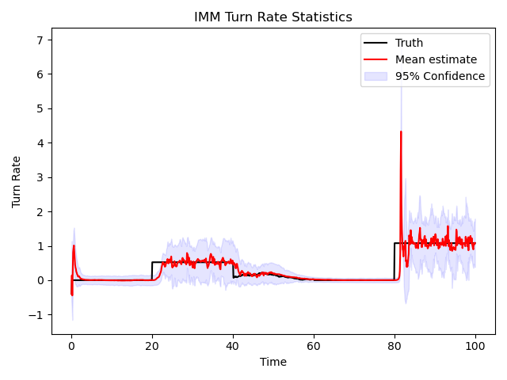
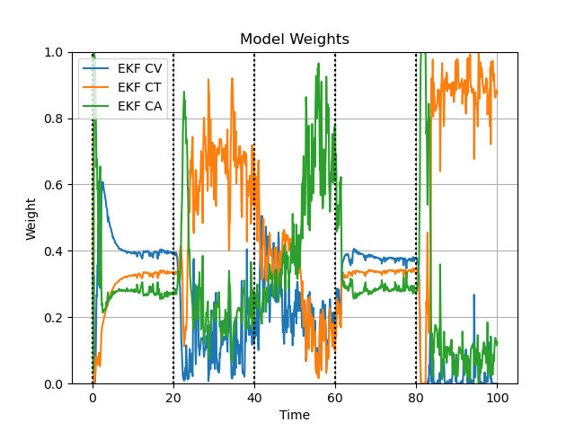
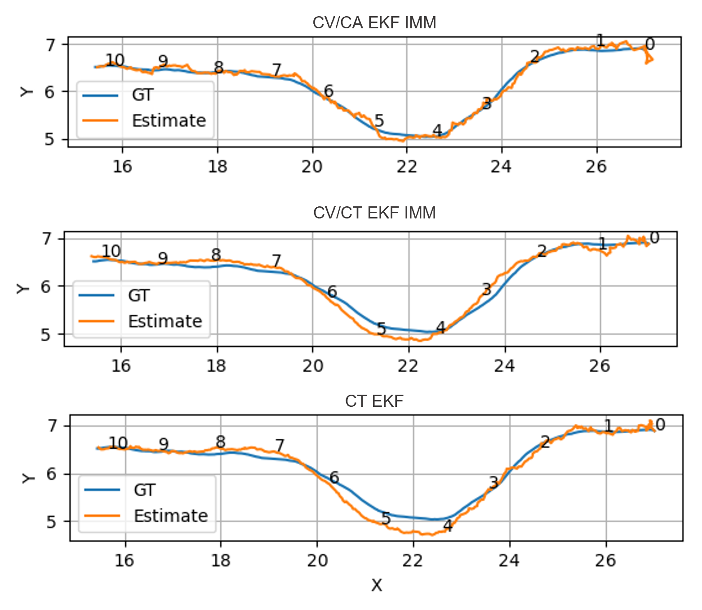

# Pedestrian Motion Tracking with IMM 
## Authors 

Torstein Ørbeck Eliassen [@gravlaks](https://github.com/gravlaks)  
Brian Dobkowski [@bdobkowski](https://github.com/bdobkowski)  
Bradley Collicott [@bcollico](https://github.com/bcollico)

## Introduction
*For the application of pedestrian motion tracking, an Interacting Multiple-Model filter (IMM) is developed for estimating 2D motion from the perspective of a static observer. The filtering system employs the constant velocity, constant turning, and constant acceleration motion models with tunable switching probabilities to capture the multimodal nature of human motion. UKF-IMM, EKF-IMM, and iEKF-IMM filters are implemented on both synthetic and real pedestrian data, and measures are taken to increase numerical stability of the algorithms.*

## Results 

### Simulated data

To validate the filters and the IMM algorithm, trajectories were simulated using the same
dynamics models used for propagation within the filter models, but with different noise. An example trajectory is given below: 

**Performance on simulated trajectory**
We show the performance of the IMM EKF, together with the IMM probabilities (comparison with unimodal filters can be found in the report). 

### Performance on pedestrian dataset

The data was fetched from : 

D. Yang, L. Li, K. Redmill, and U. Ozguner, “Top-view trajectories: A
pedestrian dataset of vehicle-crowd interaction from controlled experi-
ments and crowded campus,” pp. 899–904, 06 2019

**IMM results vs. unimodal results**

